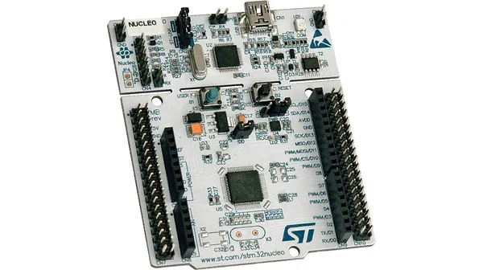

# Accelerometer Starter Project

# About
The purpose of this starter project is to guide you through being able to get readings from the ADXL343 accelerometer over the I2C bus on a Nucleo.

# Hardware
* Nucleo STM32G431RB



* ADXL343 accelerometer


* Lots of female-to-male, male-to-male, and female-to-female wires!
* 1 USB A to mini B cable
* Two 7.5 kOhm Resistors
* Breadboard

# Data Sheets and Pinouts

[ADXL343 accelerometer datasheet](https://www.analog.com/media/en/technical-documentation/data-sheets/ADXL343.pdf)

[Nucleo STM32G431RB User Manual (pinout on page 29)](https://www.st.com/resource/en/user_manual/um2505-stm32g4-nucleo64-boards-mb1367-stmicroelectronics.pdf)


# More Important Nucleo Features

Nucleos come with a removable ST-Link debugger/programmer integrated on the board, allowing extensive debugging options through a simple USB connection. STM32 MCU have a wide range of hardware capabilities, with dedicated internal circuitry for I2C, SPI, UART, timers, and more.
Read [this](https://github.com/umrover/embedded-testbench/wiki/Nucleo-Quick-Start) for more information.

# What is an accelerometer?
The ADXL343 is a digital accelerometer that you’ll be using today. This device measures acceleration in all the x, y and z axes and sends this data via a serial line using the I2C communication protocol.

# What is I2C?
I2C offers two-way communication between a device such as the ADXL343 (slave) and the Nucleo (master). Notice the SDA (Serial Data) and SCL (Serial Clock) pins on both the accelerometer and the Nucleo.

I2C relies on the clock line (SCL) to keep time between the devices connected so that they can communicate at the same rate. The data line (SDA) is a shared data line between the devices.

Each device enabled with I2C also has an address. Try to find the address for the ADXL343 accelerometer in the [datasheet](https://www.analog.com/media/en/technical-documentation/data-sheets/ADXL343.pdf).

Read [this](https://learn.sparkfun.com/tutorials/i2c/all) if you want to learn more about I2C.

# Wiring and Set up

Setting up is very important for proper function of the accelerometer!!!

For the accelerometer to work, certain pins will need to be connected to pull up resistors. This means they are connected to a power source with a resistor between, and are always "pulled up" to high (1) until they are driven to 0 by software. This pulled up until pulled down functionality is necessary for I2C to work. 

Find the I2C communication section in the datasheet and find a diagram that shows how the pins of the accelerometer should be connected for I2C. The processor side should show I2C SDA => "D IN/OUT" and I2C SCL => "D OUT". Our processor is the Nucleo G4, and to enable I2C we will use pins PA15 and PB7 for SDA and SCL. Figure out where these pins are using the pin out.

(You can verify that these are the correct pins after getting to coding within the .ioc file, where these two pins should be marked as I2C1).

Now knowing the processor side, you can make the connections between the ADXL343 and the Nucleo, but to implement the pull up resistors, you will need to do it through the breadboard. 

Ask an ESW member if you are unfamiliar with breadboards or are confused about how to implement the pull up resistor set up from the diagram.

## Starter code
If you already cloned mrover-esw for the [other starter projects](https://github.com/umrover/mrover-esw), you do **not** need to do it again for the accelerometer.

To get the starter code, open up a new terminal window, clone the mrover-esw repository, and make a tutorial branch for yourself\
```$ git clone https://github.com/umrover/mrover-esw``` (if not already cloned)\
`$ cd embedded-testbench`\
`$ git checkout starter-projects`\
```$ git checkout -b starter/<name>```

Open up the Cube IDE project by opening the folder and double clicking on the .project file. Make sure that you already have Cube IDE installed.

## Hexadecimal
Hexadecimal is a numbering system which uses base-16. Unlike our usual base-10 decimal system (0123456789) or the base-2 binary system (01), hexadecimal has a total of 16 different digits (0123456789ABCDEF). We tend to use hexadecimal to express our binary-based ideas because it is easier to read and easy to convert to and from binary. Each hexadecimal digit is equal to four bits (binary digits). For example, Hex number 0xA is equivalent to binary number 0b1010, or decimal number 10.

Most numbers in the datasheet will be expressed in hexadecimal, especially when referring to addresses, memory locations, or registers.

[Here](https://www.rapidtables.com/convert/number/hex-to-decimal.html) is a good online converter for going from binary to hex. Go ahead and use that calculator to convert the binary string to hex. A thing to note about hex values is that they are all prefixed by `0x`.

## What is a register?
A register is a location on a device such as the accelerometer that one can access data from or send commands to. We will be both writing to and reading from the accelerometer's registers. We will write to registers in order to set up the accelerometer for usage. We will read from registers which hold the acceleration data we are looking for. Descriptions of each register (what data you can read, or what you can do by writing to it) can be found on the [datasheet](https://www.analog.com/media/en/technical-documentation/data-sheets/ADXL343.pdf). 

## What is an I2C address?
A master device can have multiple slaves. Therefore, each slave device needs a distinct address which the master can use to select the correct device to communicate with over the I2C bus.

The accelerometer I2C address and registers we will need to write to and read from are summarized here. Both device addresses and register locations are typically written in hexadecimal.

Useful addresses and registers. These come from the adxl343 datasheet.


## What are LSB and MSB?
We may have to work with data values which are many bytes long. However, sometimes we are restricted to working with just one byte at a time. Therefore, we split large data values into "most significant" and "least significant" bytes.

The accelerometer returns acceleration values for each axis as a two-byte number. However, each byte of a single reading is stored in a separate register on the accelerometer, so we must read them separately and combine the two numbers. Since we are dealing with binary numbers, we can accomplish this using bitwise operations, such as bitwise left shift (<<) and bitwise OR (|).

As a decimal analogy to this, imagine you have the number 2048. In MSB/LSB format it could be split up as 20 and 48. In order to combine the two correctly, you have to shift 20 over 2 decimal places (multiply by 10^2) and then add it to 48.
When it comes to retrieving and combining the data of the MSB and LSB registers, the idea is the same. 

Splitting the data to be sent in two registers allows for higher precision data to be sent. [More in depth info](https://bit-calculator.com/most-and-least-significant-bit).

## How to interface with registers?
For writing to and reading data from registers, some functions are provided to you.

If you look inside the main.c, you'll see:
```void i2c_read(uint8_t dev_addr, uint8_t mem_addr, uint8_t* buf, uint16_t size)``` 
```void i2c_write(uint8_t dev_addr, uint8_t mem_addr, uint8_t* buf, uint16_t size)```

These functions provide wrappers around the underlying I2C transactions between the nucleo and the peripheral. `dev_addr` is the I2C address of the device, `mem_addr` is the register we want to read from or write to, `buf` is a buffer (array) containing the data we want to send to the peripheral device OR containing the data we receive back from the device (in the case of a read). `size` is the number of bytes we are sending from or receiving into the buffer.

Take a look through the implementations of these functions to understand how they work.

## Getting Started

The first step of this project is to configure the accelerometer and get it out of sleep mode and into measurement mode, so we can start collecting data.

If you haven't already, find the accelerometer's I2C address on page 16 of the [datasheet](https://www.analog.com/media/en/technical-documentation/data-sheets/ADXL343.pdf). Consider the ALT ADDRESS pin to be low. Once you find it, set the `i2c_dev_address` constant in your code.

Several constants are already filled in for you. These all have names such as `x_lsb_reg`, `x_msb_reg`, etc. These are the registers we will read from to retrieve data from the accelerometer.

The setup process for our accelerometer involves writing values to the power control and data format register on the accelerometer. Find the correct hexadecimal values for these registers in the datasheet and fill in the relevant constants. Look in the "Register Map" section of the datasheet starting on page 23 to find the values.

Now that we have all of our registers in place, we can begin the setup process.

We will perform three writes.

### Formatting Output Data
Before we wake our device, we need to format the output data by writing to the DATA_FORMAT register. How do we know what to write to the register? Each register on the accelerometer has 8 bits. Each bit for a given register controls a particular function, and we can alter the behavior of the device by writing a 0 or 1 to any particular bit of any particular register.

Find the DATA_FORMAT register description in the datasheet. You will see a diagram that looks like this:


This diagram shows the breakdown of the register into its specific bits (D7, D6, ... D0). Bits have names associated with their functions. For example, bit 7 (D7) is the SELF_TEST bit. Bits 1 and 0 (D1, D0) both control Range. Bit 4 (D4) is always 0.

You can find descriptions of each bit and what they do below the diagram. 

We need to construct an 8-bit binary number such that when we write it to the DATA_FORMAT register it will set the bits that we want to set. For example, 0b00000000 would set all bits to 0 and 0b11111111 would set all bits to 1.

Note: 0b is a prefix which allows you to use binary literals in the C language. Appending 0b to a number will make C interpret it as a binary string. Use this when you write out any binary in your C programs.

We want to configure the DATA_FORMAT register such that the device is in full resolution mode, right justified mode, and a g range of +-16. The other settings are irrelevant and may be set to 0. Come up with a binary number to write to the register to get these desired behaviors. Ask an ESW member if you need any help. 

Once you have your binary number, set the `data_format_val` constant. You can write it in binary or hex. On the next line, observe that a call to `write_byte_data` writes this value to the DATA_FORMAT register of the accelerometer.

### Clearing the Link Bit
We clear the link bit of the power control register before continuing. This is done for you and is the next `write_byte_data` call.

### Enter Measurement Mode (Wake Up)
Now it's time to wake our accelerometer up so that we can begin collecting data.

Find the POWER_CTL register description in the datasheet. We see another register diagram:


This time, we see that our register's bits are controlling different functions. Read through the bit descriptions to understand what each bit does.

All we need to do is wake up the device, or place it into measurement mode. Come up with an 8-bit binary number which will accomplish this, and store it in the `power_ctrl_val` constant. Ask an ESW member if you need help.

On the next line, we call `write_byte_data` again. This time, we write to the POWER_CTL register and cause the device to wake up and begin collecting data.

## Reading data from the accelerometer
Finally, our sensor is reading acceleration data and we are ready to start retrieving that data from the device's registers.

Look below where you have been working. You will see an infinite loop (`while (1)`). This is not a bug-- we loop forever on purpose because we want to keep collecting data as long as our device is on and working. Inside of the loop, you will see three calls to `get_decimal`. This is a function which reads the appropriate registers on the accelerometer in order to get the sensor data we want. You can see that we call this function three times, for each axis x, y, and z.

`get_decimal` is incomplete. You will need to fill in several sections to make it work properly and return good data to you. Revisit the MSB/LSB section of this tutorial for some guidance. Follow the TODOs inside of the `get_decimal` function and complete the implementation.


## Further Instructions 
Initialize the sensor, and read x, y, and z data from it. The starter code along with this tutorial has some hints on what to do. Make sure you're taking a close look at the datasheet and all the registers to verify that you are turning the accelerometer on with all the correct bits set in the relevant registers, having it read data correctly, and for what values you need for unit conversions to m/s^2. Feel free to reach out to the ESW lead or other returning members for guidance!

## Building
Before you test your code you will want to see that it can 'compile' by building the project. If there are any errors, fix them.

## Testing
Because in this tutorial we do not print the data anywhere, we will have to use the debugger to investigate whether or not the code is working properly. This is good practice for what you may expect to see in the future.

## Debugging in Cube IDE

Make sure that your Nucleo is connected to your computer. Also make sure that your project is able to build.

Click on Run -> Debug As -> 1 STM32 C/C++ Application.


On the following screen, you can just press OK.


If your device is unable to detect the Nucleo connected to it, you may see the following screen.


Retry the previous steps and if that does not work, then either double check your connections, or seek a new Nucleo board.

In the future, you may be able to get away with just clicking on Run -> Debug, or using the keyboard shortcut F11. This does not work the first time if you have never clicked on the Debug As button.


Now that you're in the debug mode, you may set breakpoints and run through your code or pause at any given moment. When paused, we can also see the values of certain variables. We will use this feature to view if the data we are reading for our accelerometer is reasonable.


## Congratulations!
You have completed the Accelerometer on Nucleo Starter Project! Contact the ESW lead for further instructions. 