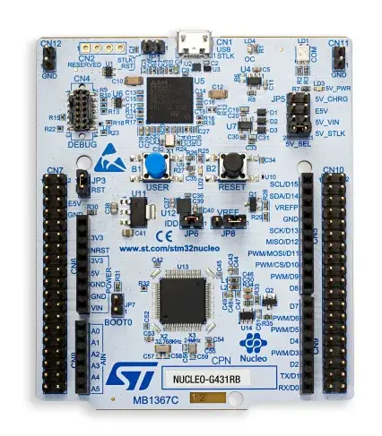
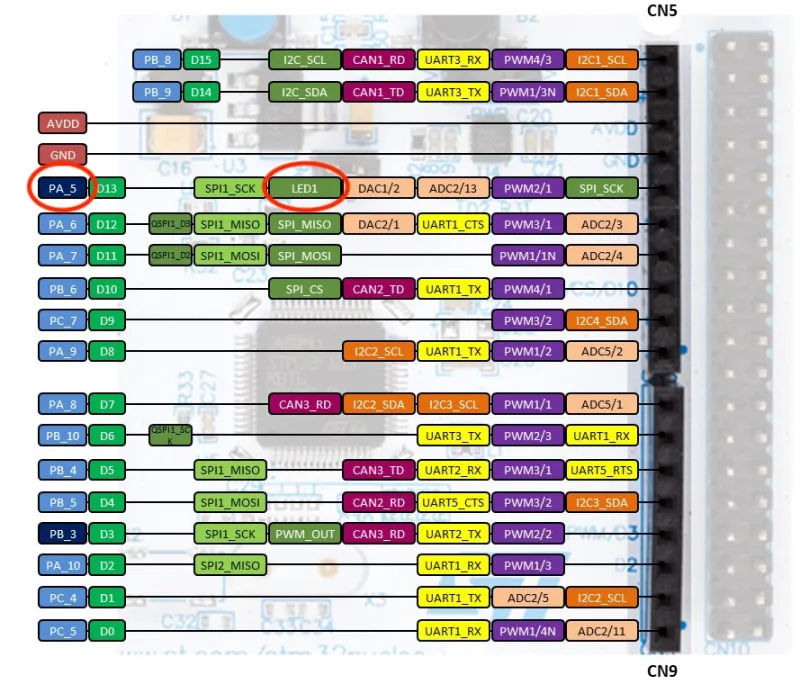

# LED Starter Project

## About
This tutorial is intended to get you more familiar with a Nucleo
(with STM32G431RB MCU) and the Cube IDE.
You will be asked to develop code such that the LED on the Nucleo
will light up whenever the Nucleo’s button is pressed down.

Just as a reminder, if you have any questions, feel free to reach out to any
of the ESW leads or members. This project isn't meant to be high-stakes,
so please reach out if you ever get stuck!

## Instructions
As mentioned earlier, the goal is to make sure that the button is able to activate the LED.

As you walk through the guide, keep the following questions in mind:

* Which pin is linked to the button and which pin is linked to the LED?
* Are those pins activated on the .ioc file?
* Have you looked through the HAL drivers to see how to read from and write to pins?
* Do you know which pins have to be read from and which pins need to be written to?
* Do you know what to write to the pin that needs to be written to and when?

## Prerequisites

* STM32CubeIDE [installed](../../stm32cubeide/index.md)
* STM32G431RB Nucleo (pictured below)

## Guide

Open up Cube IDE and create a new project called tutorial by following the steps in the [Cube IDE New Project Guide](../../stm32cubeide/index.md#creating-a-new-project).

When creating a new project, the pins are not configured by default. This matters because on the Nucleo, the button and the LED are already connected to a particular pin so we need to change the pin's functionality if we want to use it. In order to determine which pins are connected to the button and the LED, one can visit [this](https://os.mbed.com/platforms/ST-Nucleo-G474RE/) page.

On this page, you will find some pinouts. Based on the pinouts, you should be able to tell that the button is connected to pin PC13 and that the LED is connected to PA5.

Head back to the Cube IDE and if the .ioc file is not open already, open it from the Project Explorer located on the left. You should be able to see a graphical interface with the chip on it.

> **Some images may include STM32F303RETx instead of STM32G431RBTx**: Please ignore the differences!

The first thing we want to do is set PC13 pin (which is connected to the push button) to be a GPIO input. This means that the pin will be set so that we can choose to read digital input in our code. Reading digital input means that we can read 3.3V as high (logic 1) and read 0V as low (logic 0). This is relevant because this means that we can be able to tell if the push button is pressed down or released.

On the graphical interface (also called the .ioc file), locate PC13 and click on it. Then select GPIO_Input to change its configuration.

The next thing we want to do is set PA5 (which is connected to the LED) to be a GPIO output. This means that we will be able to make the pin either be set to 3.3V (high) or 0V (low). By default, the pin starts off as low.

On the .ioc file, locate PA5 and click on it. Select GPIO_Output to change its configuration. You may need to scroll down a bit. Note that the pin may already be set to GPIO_Output by default, so you may choose to not do anything new.

Make sure to save your changes by saving the file. Either run the keyboard shortcut Ctrl + S on your keyboard or click on File -> Save.

You will then see a window asking if you want to generate Code. Click Yes.

You may also see a window asking about opening the associated perspective. Click Yes.

We have now successfully configured our pins and generated the code for it. Now it is time to write the logic to link the button and the LED together.

Begin by opening up the `src/main.c` file.

When writing code, you will only want to write in specific sections. A good rule of thumb is to only put your code in between where it says
`USER CODE BEGIN` and `USER CODE END`. This is necessary because otherwise, the automatic code generation from the Cube IDE
will overwrite and delete your code.

We will be using the HAL library so that we can call a single function to perform operations such as reading digital input and writing digital output.

The HAL functions that we are interested in are `HAL_GPIO_ReadPin(gpio-port, gpio-pin)` and `HAL_GPIO_WritePin(gpio-port, gpio-pin, pin-state)`.

See below for a demo on how we can access data in our case.

When reading in the pin state PC13, do note that the value read depends on if the button is pushed down or released AND if the button is active low or active high.
In our case, the button is active high. This means that when the button is pushed down, the value returned is a 1.

Based on this information, you should now be able to implement logic on how to link the button to the LED. If you need additional resources, you may choose to refer to [this](https://medium.com/vicara-hardware-university/stm32-guide-gpio-and-buttons-8303e6c8cb44) guide on how to GPIO pins and buttons. Also, you are always welcome to ask another member for help!

After writing your code, you will most certainly want to build and run your program on actual hardware.

Connect an STM32G431RB Nucleo board to your computer via USB. Ask an experienced member or an ESW lead if you need assistance in obtaining such hardware.

Before building your program, ensure that all relevant files have been saved to ensure that code generation has been done.

Then, build your project by clicking `Project`→`Build All` (or `Project`→`Build Project`) or using the keyboard shortcut `Ctrl + B`.

After building your project, you will see the console which will tell you whether or not your project built successfully. As long as there are no errors, then your project built successfully. You should also look over the warnings if you have any since those hint at potential problems in your code.

Once your project has built successfully, you will now want to flash the code onto your Nucleo and let it run. Click on `Run`→`Run`. Make sure that your Nucleo device is connected to your computer via USB or else this will not work.

Now press down on the button and see if the LED properly lights up. If they do, congratulations! You have completed your first ESW project!

Be sure to show a demo of your project to an ESW lead.

If you need help debugging, feel free to ask any of the subteam leads or any of the other members.

## Useful Resources
You may or may not need all of these links in the future.

1. [Board Reference Manual](https://www.st.com/resource/en/reference_manual/rm0440-stm32g4-series-advanced-armbased-32bit-mcus-stmicroelectronics.pdf)
2. [Chip Datasheet](https://www.st.com/resource/en/datasheet/stm32g431c6.pdf)
3. [HAL-Driver](https://www.st.com/resource/en/user_manual/dm00122016-description-of-stm32f3-hal-and-low-layer-drivers-stmicroelectronics.pdf)
4. [Pinout](https://os.mbed.com/platforms/ST-Nucleo-G474RE/)
