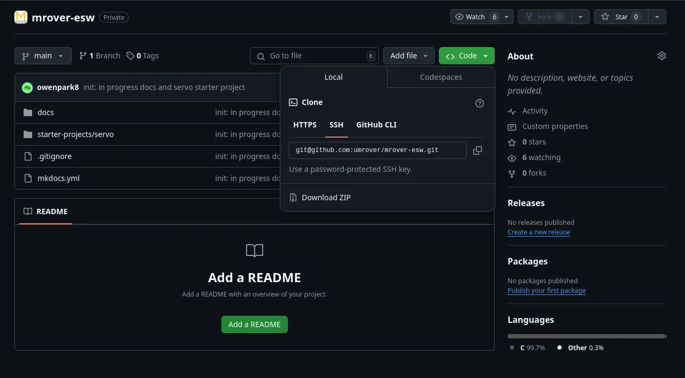
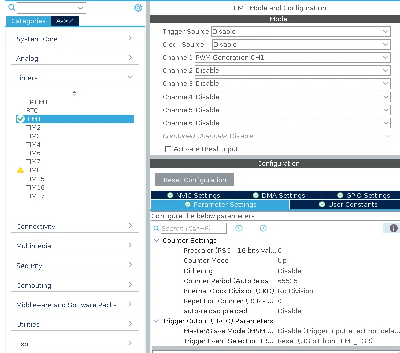

# Servo Starter Project - Part 1 - PWM

This starter project is made up of two parts: PWM and CAN. This is Part 1 - PWM.

By the end of this part, you should have an understanding of timers and PWM (pulse width modulation)
signals. 

Just as a reminder, if you have any questions, feel free to reach out to any
of the ESW leads or members. This project isn't meant to be high-stakes,
so please reach out if you ever get stuck!

## Prerequisites

* STM32CubeIDE [installed](../../stm32cubeide/index.md)
* LED Project [completed](https://github.com/umrover/embedded-testbench/wiki/Nucleo-LED-Starter-Project) and shown to an ESW lead
* Git [setup](https://github.com/umrover/mrover-ros/wiki/Intro-to-the-Command-Line-and-Git)
* STM32G431RB Nucleo
* Servo

## Intro

As mentioned earlier, by the end of the project you should be able to drive a servo.
This project will also teach some coding practices used for STM32 code.
While you are working through the project, keep the following in mind:

* How could you decrease the amount of space or processing power needed for your code?
* How could you document your code so that others can easily read and understand it?
* How could you write your code so that it can easily be adjusted for different pins, different number of servos, etc.?

## Guide

### 1. Setting up the project
Since you already have practice creating a project, you will only need to clone and open the
premade STM32 project for this starter project.

Go to [this repository](https://github.com/umrover/mrover-esw), click the "Code" tab, and copy the SSH URL.


You now have the URL you need to clone the project.

Clone the project onto your local computer by running the following command in your terminal:
```sh
git clone <URL copied in above step>
```

Enter the directory:
```sh
cd mrover-esw
```

Then, create a new branch for yourself
```sh
git checkout -b <starter/your-name>
```

Open STM32CubeIDE and open the Servo ***Part 1*** starter project (the directory named `p1-pwm`). Follow the following
[guide](../../stm32cubeide#opening-an-existing-project) to open an existing project if you do not
know how to do so.

### 2. PWM timer configuration



Once the .ioc is open, configure the pins for PWM.

1. Select the PC0 pin and change it to TIM1_CH1.
2. On the left side of the .ioc file, under Timers, select TIM1.
3. Change Channel1 from "Disable" to "PWM Generation CH1".

You will now have to configure two values&mdash;Prescaler and Counter Period&mdash;in order to
correctly set up this PWM timer. These values are located in the "Parameter Settings" and must be
calculated. Refer to the timer [reference guide](../../../info/timers.md) for information on
calculating these values.

## Creating the header file
Having a Servo object will make it easier to adjust the number servos or where the servos are in the future, so for good practice, we will create a servo object and function prototypes in a header file. 

On the menu to the left, in Core > Inc, create a new header file named servo.h


Near the top of the header file, copy in the following lines:

`#pragma once`

`#include "stm32f3xx_hal.h"`

`#include <stdlib.h>`


Then, create a Servo struct with 3 member variables:
* `TIM_HandleTypeDef *timer` : this tells the STM which timer is being used to generate the PWM signal
* `uint32_t channel` : this tells the STM which channel is being used for the PWM signal
* `uint32_t *output` : this is the address of the output register where the number of ticks that are set to high is stored

To avoid getting errors when using your Servo struct later on, make sure to declare it like this:
```
typedef struct {
	// TODO: fill this in
} Servo;
```

Create the function prototypes for the 3 functions that are needed to create and use a Servo object:
* `new_servo`
* `initialize_servo`
* `set_servo_angle`


Try to fill out the header on your own, but here are some hints if you get stuck:
* `new_servo` should take in parameters and return a Servo*
* `initialize_servo` should initialize an existing Servo* to have a certain starting angle, it should also start the timer
* `set_servo_angle` should convert an angle to the number of ticks for the CCR 


## Implementing Servo functions

Now that you have a Servo struct and function prototypes, it's time to implement the functions.

On the menu to the left, in Core > Src, create a new .c file named servo.c


Don't forget to #include your header file.

Here is an example of what a function that creates a new object should look like in C: 


To initialize a servo object, you must initialize the timer used to generate the PWM signal. To do this, use HAL_TIM_PWM_Start(). Find more information about this built-in HAL function [here](http://www.disca.upv.es/aperles/arm_cortex_m3/llibre/st/STM32F439xx_User_Manual/group__tim__exported__functions__group3.html)

When implementing set_servo_angle, keep in mind what PWM signal corresponds to what angle. Check back on the [servo datasheet](http://www.ee.ic.ac.uk/pcheung/teaching/DE1_EE/stores/sg90_datasheet.pdf) to determine this.


## Testing your servo functions

Now that you have the functions to create a servo object and change the angles, it's time to test them out in main.c.

Go to main.c and make sure to #include servo.h in the /* USER CODE BEGIN Includes */ section


In the main function, create a new servo object using the new_servo function. Remember to put your code in a USER CODE spot. The timer parameter for `new_servo` should be a `TIM_HandleTypeDef*`, so look through main.c and find the name for the TIM_Handle that is being used. The channel parameter should correspond with which timer channel you are using (remember we set our pin to TIM1_CH1). The output parameter is the address of the register that holds the number of ticks that are set high in the output signal. For PWM signals, this is the CCR (compare and capture register), which is a member of the TIM object. Servo's output variable should be `&(TIM1->CCR1)` if using TIM1 and CH1.

Once you have the servo created, add in the `initialize_servo` function to initialize the timer and set the starting angle. Then, in the `while(1)` loop, change the angle of the servo a few times to make sure your `set_servo` function works and that the PSC and ARR you selected in the .ioc are correct. Between each function call make sure to add a delay (Hint: there is a built in HAL function for delays).

When you are satisfied with your code, make sure it builds and then get a Nucleo, a logic analyzer, and some jumper cables to check your PWM signals. If you think the PWM signals are correct based on the [datasheet](http://www.ee.ic.ac.uk/pcheung/teaching/DE1_EE/stores/sg90_datasheet.pdf), you can test your code on a servo. If you are unsure, just ask for help!

# Logic Analyzer
The simplest method for debugging a digital signal is often to use a logic analyzer. Please install [Logic](https://www.saleae.com/downloads/) on your laptop.

To use Logic, connect PC0 to one of the pins of the logic analyzer and make sure the logic analyzer is grounded to the Nucleo. Then, flash the code and press the play button. If you wrote code in the main while loop to change the servo angle a few times (which you should), you'll notice the signal in Logic changing. 
Play around with Logic:
* Zoom in and out
* Pause the display
* Mouse over the different parts of the signal
* Try to understand what all the different numbers mean


# Wiring the Servo
In order to properly wire the servo, first consult the [datasheet](http://www.ee.ic.ac.uk/pcheung/teaching/DE1_EE/stores/sg90_datasheet.pdf).
* How much voltage does the servo need?
* Which wires are signal, power, and ground?

In order for the signal to work, the servo and the Nucleo must have a common ground. Connect the servo's ground wire to one of the ground pins on the Nucleo, the power to the appropriate power pin on the Nucleo, and the signal wire to PC0.

If you have any questions, don't be afraid to reach out to the ESW lead, SAM(s), or Embedded lead.
