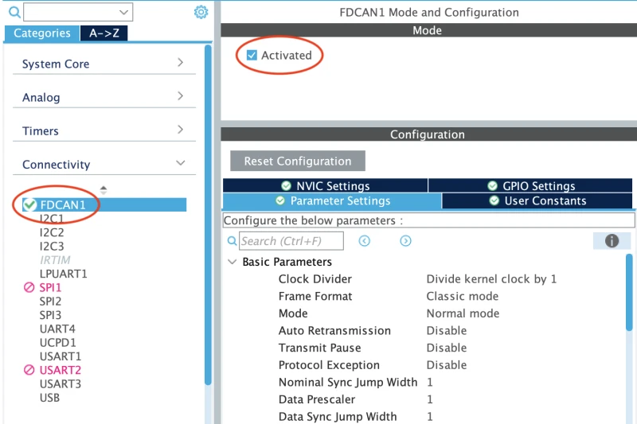

# Servo Starter Project - Part 2 - CAN

This starter project is made up of two parts: PWM and CAN. This is Part 2 - CAN.

In this project, you will be using the CAN peripheral on the STM32G431RB Nucleo to send a CAN
message to another Nucleo board. The message will contain information about the angle the servo
should be set to. If you send a successful message, the servo on the other board should rotate to
the specified angle. By the end of this part, you should have an understanding of the CAN
(Controller Area Network) communication protocol.

Just as a reminder, if you have any questions, feel free to reach out to any ESW lead or member.

***Before starting this project***, please give the [CAN info page](../../../info/communication-protocols/index.md#can)
a read. It will get you start on the basics of CAN communication. ***Do not read "Using the Kvaser Bit Timing Calculator."***

## Prerequisites

* STM32CubeIDE [installed](../../stm32cubeide/index.md)
* LED Starter Project [completed](../led/index.md) and shown to an ESW lead
* Servo Part 1 Starter Project [completed](part1-pwm.md) and shown to an ESW lead
* STM32G431RB Nucleo
* MCP2551 CAN tranceiver

## Guide

### 1. Setting up the project
Assuming you have already completed the Servo Part 1 Starter Project, you will not have to clone
the project again.

Open STM32CubeIDE and open the Servo ***Part 2*** starter project (the directory named `p2-can`).

### 2. Understanding our CAN bus

In order to send messages to the CAN bus, we need to understand how our CAN bus is set up. The
servo board that we are sending messages to is set up to receive CAN 2.0B messages with an
**extended identifier** at a baud rate of **500 kbps**. It will only respond to messages with the
**identifier `2024`**. It will then read only the first byte of the data payload and set the servo
to the angle specified in that byte. The angle must be between 0 and 180 degrees.

For example, if we send a message with the identifier `2024` and the data payload `90` (decimal),
the servo will rotate to 90 degrees.

### 3. CAN configuration

Once the .ioc is open, activate the FDCAN peripheral. We can do this by clicking on the FDCAN
peripheral in the `Connectivity` tab on the left side of the .ioc. Then, check the `Activated` box.



Next, we need to configure the timings for the CAN bus. Click on the `Parameter Settings` tab
(as shown above). We will be using CAN 2.0B *not* CAN FD, so `Frame Format` should be set to
"Classic." Since we are using "Classic," we do not need to worry about the data bit rate. We will
only need to properly set the following values:

1. Nominal Prescaler
2. Nominal Sync Jump Width
3. Nominal Time Seg 1
4. Nominal Time Seg 2

Again, please refer to the [CAN info page](../../../info/communication-protocols/index.md#can) for
more information on these values.

There is a very in depth guide to configuring these values for STM32 MCUs in the
[CAN FD Bit Timing](../../../info/communication-protocols/index.md#can-bit-timing) section of the
docs. However, for the purposes of this starter project, you can use [this online calculator](https://phryniszak.github.io/stm32g-fdcan/)
designed for STM32G4 boards. Our FDCAN peripheral is clocked at 72 MHz, and the CAN bus we are
trying to communicate on is running at 500 kbps. The calculator will give you the values you need
to input into the .ioc. ***Ignore all CAN FD related values in the calculator.*** For Nominal Sync
Jump Width, make sure to read the note at the bottom of the calculator.

After inputting the bit timing parameters, ensure that `Nominal Baud Rate` is 500,000 bit/s.
You can now save the .ioc and generate the code.

### 4. Writing the CAN code

In the `main.c`, you should see 6 TODOs. We will walk through each of them.

As a reminder, when you are writing code, make sure to write within the `/* USER CODE */` tags.
This will ensure that your code is not overwritten when you regenerate the code.

#### TODO 1: Create the necessary variables to send a CAN message
In order to send a CAN message, we need to create two objects:

1. The message header
2. The message data

The **message header** is an object of type `FDCAN_TxHeaderTypeDef`. This will store information about
the CAN message we are sending, such as the identifier, the data length, the frame format, etc.

The **message data** is an array of bytes that will be sent in the CAN message. In this project, we
will only be sending one byte of data, which will represent the angle the servo should be set to.
To declare a byte of data, you can use the `uint8_t` type.

#### TODO 2: Start the CAN peripheral

We'll notice that there towards the top of the `main.c` file, there is the following object:

```c
FDCAN_HandleTypeDef hfdcan1;
```

This is the handle for the FDCAN peripheral. We will need to initialize the FDCAN peripheral
using the `HAL_FDCAN_Start` function. This function takes in the handle for the FDCAN peripheral.

We can use the following code snippet to start the FDCAN peripheral:

```c
HAL_FDCAN_Start(&hfdcan1);
```

#### TODO 3: Form the CAN message header

In this step, we will need to fill out the `FDCAN_TxHeaderTypeDef` object that we created in TODO 1
with the necessary information to send a CAN message.

Below is the structure of the `FDCAN_TxHeaderTypeDef` object:

```c
/**
  * @brief  FDCAN Tx header structure definition
  */
typedef struct
{
  uint32_t Identifier;          /*!< Specifies the identifier.
                                     This parameter must be a number between:
                                      - 0 and 0x7FF, if IdType is FDCAN_STANDARD_ID
                                      - 0 and 0x1FFFFFFF, if IdType is FDCAN_EXTENDED_ID               */

  uint32_t IdType;              /*!< Specifies the identifier type for the message that will be
                                     transmitted.
                                     This parameter can be a value of @ref FDCAN_id_type               */

  uint32_t TxFrameType;         /*!< Specifies the frame type of the message that will be transmitted.
                                     This parameter can be a value of @ref FDCAN_frame_type            */

  uint32_t DataLength;          /*!< Specifies the length of the frame that will be transmitted.
                                      This parameter can be a value of @ref FDCAN_data_length_code     */

  uint32_t ErrorStateIndicator; /*!< Specifies the error state indicator.
                                     This parameter can be a value of @ref FDCAN_error_state_indicator */

  uint32_t BitRateSwitch;       /*!< Specifies whether the Tx frame will be transmitted with or without
                                     bit rate switching.
                                     This parameter can be a value of @ref FDCAN_bit_rate_switching    */

  uint32_t FDFormat;            /*!< Specifies whether the Tx frame will be transmitted in classic or
                                     FD format.
                                     This parameter can be a value of @ref FDCAN_format                */

  uint32_t TxEventFifoControl;  /*!< Specifies the event FIFO control.
                                     This parameter can be a value of @ref FDCAN_EFC                   */

  uint32_t MessageMarker;       /*!< Specifies the message marker to be copied into Tx Event FIFO
                                     element for identification of Tx message status.
                                     This parameter must be a number between 0 and 0xFF                */

} FDCAN_TxHeaderTypeDef;
```

The following code snippet shows how to fill out the `FDCAN_TxHeaderTypeDef` object to send a
Classic CAN (CAN 2.0) message with a standard identifier of 88 and a data length of 8 bytes:

```c
// In TODO 1:
// FDCAN_TxHeaderTypeDef TxHeader;

TxHeader.Identifier = 88;
TxHeader.IdType = FDCAN_STANDARD_ID;
TxHeader.TxFrameType = FDCAN_DATA_FRAME;
TxHeader.DataLength = FDCAN_DLC_BYTES_8;
TxHeader.ErrorStateIndicator = FDCAN_ESI_ACTIVE;
TxHeader.BitRateSwitch = FDCAN_BRS_OFF;
TxHeader.FDFormat = FDCAN_CLASSIC_CAN;
TxHeader.TxEventFifoControl = FDCAN_NO_TX_EVENTS;
TxHeader.MessageMarker = 0;
```

We will need to fill out the `FDCAN_TxHeaderTypeDef` object with the correct values for the CAN
message you are trying to send. Refer back to [2. Understanding our CAN bus](#2-understanding-our-can-bus)
for this information.

#### TODO 4-6: Send a CAN message to rotate the servo
Now that we have the CAN message header for all the messages we want to send, we can send the
message using the `HAL_FDCAN_AddMessageToTxFifoQ` function. This function takes in the handle for
the FDCAN peripheral, the message header, and the message data.

Here is an example of how to send a CAN message to turn the servo to 45 degrees:

```c
// In TODO 1:
// uint8_t TxData[1];

TxData[0] = 45;
HAL_FDCAN_AddMessageToTxFifoQ(&hfdcan1, &TxHeader, TxData);
```

### 5. Testing the project
We will now connect to the CAN bus that the other Nucleo board is connected to. We will be using
the MCP2551 CAN transceiver to connect to the CAN bus. For access to the CAN bus, please ask an ESW
lead. The CAN TX and RX pins on the STM32G431RB Nucleo can be found in the `.ioc` file. These pins
should connect to the CAN TX and RX pins on the MCP2551 CAN transceiver. The CANH and CANL pins on
the MCP2551 should connect to the CANH and CANL pins on the CAN bus.

We will now be able to test the project. To do this, we will need to build and flash the code
onto the STM32G431RB Nucleo board. Once you have flashed the code, you should see the servo
rotate to the angle specified in the CAN messages.
