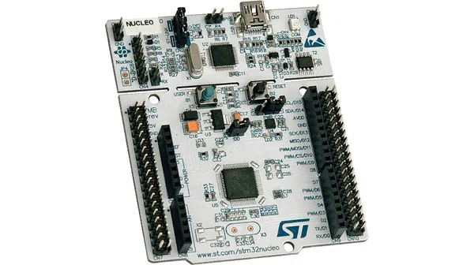
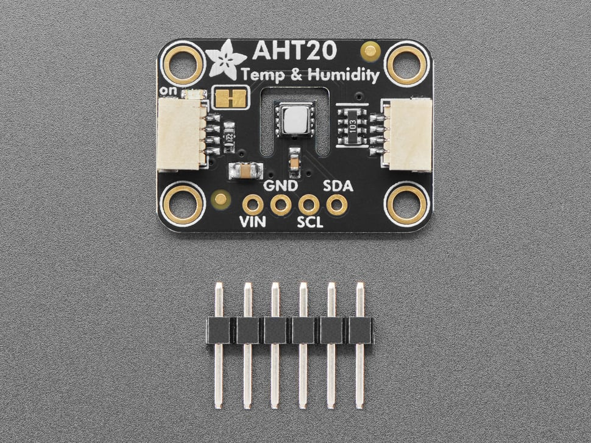

# Temperature and Humidity Starter Project

## About
The purpose of this starter project is to guide you through reading data from the AHT20 Temperature and Humidity Sensor using I2C with an STM32 Nucleo

## Hardware
* Nucleo STM32G431RB

* AHT20 Temperature and Humidity Sensor

* Lots of female-to-male, male-to-male, and female-to-female wires!
* 1 USB A to mini B cable
* Breadboard

## Data Sheets and Pinouts
[AHT20 Sensor datasheet](https://cdn-learn.adafruit.com/assets/assets/000/123/394/original/Data_Sheet_AHT20.pdf)

[Nucleo STM32G431RB User Manual (pinout on page 29)](https://www.st.com/resource/en/user_manual/um2505-stm32g4-nucleo64-boards-mb1367-stmicroelectronics.pdf)

## Hexadecimal
Hexadecimal is a numbering system which uses base-16. Unlike our usual base-10 decimal system (0123456789) or the base-2 binary system (01), hexadecimal has a total of 16 different digits (0123456789ABCDEF). We tend to use hexadecimal to express our binary-based ideas because it is easier to read and easy to convert to and from binary. Each hexadecimal digit is equal to four bits (binary digits). For example, Hex number 0xA is equivalent to binary number 0b1010, or decimal number 10. Because of this a byte can be represented by two hexadecimal digits (8 bits).

Most numbers in the datasheet will be expressed in hexadecimal, especially when referring to addresses, memory locations, or registers.

[Here](https://www.rapidtables.com/convert/number/hex-to-decimal.html) is a good online converter for going from binary to hex. Go ahead and use that calculator to convert the binary string to hex. A thing to note about hex values is that they are commonly prefixed by `0x`.

## What are LSB and MSB?
We may have to work with data values which are many bytes long. However, sometimes we are restricted to working with just one byte at a time. Therefore, we split large data values into "most significant" and "least significant" bytes.

The AHT20 returns temperature and humidity values as 2.5 byte raw values. However, each byte is sent individually, so to get the full raw temperature and humidity values we will need to combine the 2.5 bytes using the logical left shift operator (<<).

As a decimal analogy to this, imagine you have the number 2048. In MSB/LSB format it could be split up as 20 and 48. In order to combine the two correctly, you have to shift 20 over 2 decimal places (multiply by 10^2) and then add it to 48.
When it comes to retrieving and combining the data of the 2.5 bytes, the idea is the same. 

Splitting the data to be sent into multiple registers allows for higher precision data to be sent. [More in depth info](https://bit-calculator.com/most-and-least-significant-bit).

## What is I2C?
I2C offers two-way communication between a device such as the AHT20 (slave) and the Nucleo (master). Notice the SDA (Serial Data) and SCL (Serial Clock) pins on both the AHT20 sensor and the Nucleo.

I2C relies on the clock line (SCL) to keep time between the devices connected so that they can communicate at the same rate. The data line (SDA) is a shared data line between the devices.

Each device enabled with I2C also has a 7 bit address. Try to find the address for the AHT20 sensor in the [datasheet](https://cdn-learn.adafruit.com/assets/assets/000/123/394/original/Data_Sheet_AHT20.pdf).

Read [this](https://learn.sparkfun.com/tutorials/i2c/all) if you want to learn more about I2C.

## What is an I2C address?
A master device can have multiple slaves. Therefore, each slave device needs a distinct address which the master can use to select the correct device to communicate with over the I2C bus.

The AHT20 I2C address we will need to write to and read from is found [here](https://cdn-learn.adafruit.com/assets/assets/000/123/394/original/Data_Sheet_AHT20.pdf).

## What are Callbacks?
A callback is a function that is called automatically when an operation finishes (like I2C read and write operations). We don't need to make these function calls ourselves, the microcontroller instead does it for us. We will use I2C transmit and recieve callbacks to handle communicating with the AHT20 sensor without having to block other code from finishing while we wait for transmits/recieves to finish.

## Starter code
If you already cloned mrover-esw for the [other starter projects](https://github.com/umrover/mrover-esw), you do **not** need to do it again for the temperature and humidity sensor.

To get the starter code, open up a new terminal window, clone the mrover-esw repository, and make a tutorial branch for yourself\
`$ git clone https://github.com/umrover/mrover-esw` (if not already cloned)\
`$ cd mrover-esw`\
`$ git checkout -b starter/<name>`

Open up the Cube IDE project by opening the folder and double clicking on the .project file. Make sure that you already have Cube IDE installed.

# Wiring and Set up
Notice that the AHT20 sensor has 4 pins: VIN (voltage input), GND (ground), SCL (I2C clock line), and SDA (I2C data line). We will use the jumper wires and breadboard from the hardware step to make appropriate connections to all four pins. 

A breadboard is broken into two sets of long rails on the outside edges of the board and multiple shorter rails on the inner part of the board. These rails allow for easy connections between wires on the same rail. Below is a picture depicting these rails. 

Feel free to ask an ESW member for help with using a breadboard.

To wire the sensor conenct the VIN pin on the AHT20 sensor to the 3.3V pin on the nucleo and the GND pin on the AHT20 sensor to the GND pin on the nucleo. To use I2C we will need to connect the clock and data pins of the AHT20 sensor to the clock and data pins on the nucleo that we configured in our .ioc file. To see which pins we are using for I2C on the nucleo open the .ioc file and search for the pins set to I2C3_SCL and I2C3_SDA. Finally, make connections to the pins corresponding to I2C3_SCL and I2C3_SDA on the nucleo using the pinout found on page 29 [here](https://www.st.com/resource/en/user_manual/um2505-stm32g4-nucleo64-boards-mb1367-stmicroelectronics.pdf).

## Getting Started
Notice that the starter file for the project already contains multiple variable definitions. To begin set the value of the "TEMP_HUM_ADDRESS" constant to the AHT20 address found earlier. We will use this constant throughout our code when interacting with the sensor over I2C. Also notice the init() function which is called once, and has the job of pointing the "i2c" pointer to the hi2c3 object and also calling the "eventLoop()" function, which is the infinite loop that we will use to constantly send and receive data from the AHT20 sensor.

The process for receiving data from the AHT20 sensor can be broken into 3 main steps:
- Transmit a command (found in the datasheet) to the sensor to start a measurement, using the "HAL_I2C_Master_Transmit_IT" function.
- Implement the "HAL_I2C_MasterTxCpltCallback" callback function, which will be called when the sensor has finished measuring and storing the new temperature and humidity values. We need these values so you will need to request them using the "HAL_I2C_Master_Receive_IT" function and by providing the buffer defined earlier in the code. The buffer will be the location in which the received bytes will be stored.
- Finally implement the "HAL_I2C_MasterRxCpltCallback" callback function, which will be called when the sensor has sent us the raw values and the buffer is populated. You will then need to convert the raw values to the actual temperature and humidity values found in the datasheet.

## Important Notes and Tips
- Define functions for transmitting, receiving, and converting values to and from the AHT20 sensor outside of the eventLoop and I2C callback functions and then call these functions when necessary.
- As described in the [datasheet](https://cdn-learn.adafruit.com/assets/assets/000/123/394/original/Data_Sheet_AHT20.pdf) the AHT20 requires a delay after powering on the sensor. Find the delay and add it to the start of your code.
- The address parameters of the HAL I2C receive and transmit functions will need to be provided with 8 bits, bits 1-7 will be the AHT20's ID and bit 0 represents whether you are writing/reading (0/1) to the sensor. You can accomplish this using the logical left shift operator (<<) and the bitwise or operator (|).
- When converting the raw values from the buffer to the actual sensor values use the datasheet to determine which bytes from the buffer correspond to temperature/humidity and use the logical left shift operator (<<) to combine them into a single value. Then use the conversion formula from the datasheet to find the actual temperature and humidity values.

## Testing
In this tutorial we do not print out data anywhere. Because of this you will have to use the debugger to view the temperature and humidity measurements you get from the sensor. This is good practice for what you may expect to see in the future.

## Debugging in Cube IDE
Make sure that your Nucleo is properly connected to your computer and that you can build your project.

Click on Run -> Debug As -> 1 STM32 C/C++ Application.

On the following screen, you can just press OK.

If your device is unable to detect the Nucleo connected to it, you may see the following screen.

Retry the previous steps and if that does not work, then either double check your connections, or seek a new Nucleo board.

In the future, you may be able to get away with just clicking on Run -> Debug, or using the keyboard shortcut F11. This does not work the first time if you have never clicked on the Debug As button.

Now that you're in the debug mode, you may set breakpoints and run through your code or pause at any given moment. When paused, we can also see the values of certain variables. We will use this feature to view if the data we are reading for our temperature and humidity sensor is reasonable.

## Congratulations!
You have completed the temperature and humidity sensor starter project! Contact one the ESW leads for further instructions. 