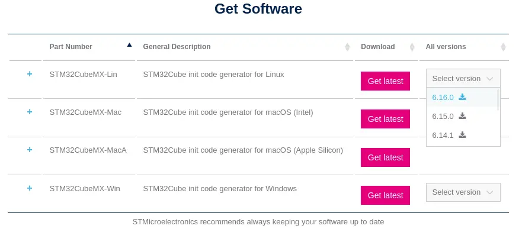
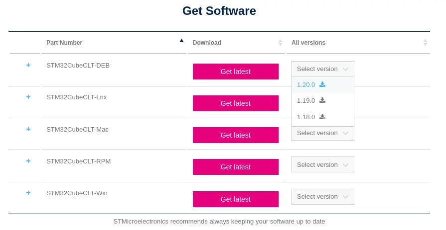
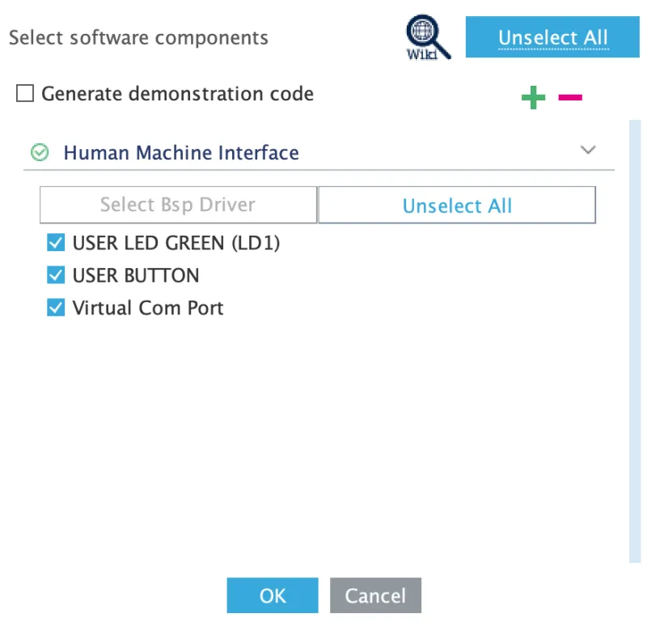

# STM32Cube\*

## About

STM32CubeMX and STM32CubeCLT allow the user to write, compile, and flash code to the STM32 microcontroller!
STM32CubeCLT contains the GCC compiler and GDB debugging tool for firmware compilation and debugging, and
STM32CubeMX contains the interface for configuring the microcontroller and project environment, and provides
a very powerful interface for automatic code generation, allowing the user to initialize an entire module with
a few clicks of a button, and have that code show up automatically in the main file.

!!! note
    If you've taken EECS 373, you have likely used STM32CubeIDE, which is an IDE that packages both of these tools
    together with Eclipse. However, STM32CubeIDE is a very heavy program, and newer versions no longer integrate with CubeMX,
    so we choose to use the lighter weight STM32CubeMX and STM32CubeCLT tools in combination with CMake and your favorite
    text editor or IDE.

    We do still install CubeIDE (optionally) for graphical debugging.
    See [Debugging with STM32CubeIDE](#debugging-with-stm32cubeide).

    STM now has a suite of VS Code extensions that support debugging.

!!! note
    For newer members, EECS 373 no longer uses STM32 MCUs.

## Downloading and Installing the Cube Tools (Linux)

On Ubuntu/Debian, the whole toolchain (CubeMX, CubeProgrammer, CubeCLT, the ARM GNU toolchain,
`uv`, and everything else `scripts/build.sh` needs) is set up by one script, run once from the
repo root:

```sh
./scripts/bootstrap.sh
```

This installs [ansible](https://docs.ansible.com/) (if it isn't already present) and runs the
`ansible/bootstrap.yml` playbook, which installs system packages, the ARM GNU toolchain, `uv`, the
cube tools, initializes git submodules, writes your `PATH` and application launcher entries, and
sets up the python virtual environment at `tools/.venv`.

The cube tools can't be downloaded automatically as ST gates all of them behind a login (a free
MyST account; you may use any email address) with no stable download URL. Partway through,
`./scripts/bootstrap.sh` will pause and ask you to:

- Go to the CubeMX [download page](https://www.st.com/en/development-tools/stm32cubemx.html),
  select the **Linux** installer, and download it into `install/` at the repo root.

   

- Go to the CubeProgrammer [download page](https://www.st.com/en/development-tools/stm32cubeprog.html),
  select the **Linux** installer, and download it into `install/` as well.
- Go to the CubeCLT [download page](https://www.st.com/en/development-tools/stm32cubeclt.html),
  select the **Debian Linux** installer, and download it into `install/` as well.

   

- *Optionally*, if you want a graphical debugger other than VS Code, go to the CubeIDE
  [download page](https://www.st.com/en/development-tools/stm32cubeide.html), select the
  **Debian Linux** installer, and download it into `install/` too. It is a ~3 GB download and is
  skipped when absent, since nothing in the build flow needs it.
- Press `Enter` in the terminal running `bootstrap.sh` to continue.

!!! note
    `install/README.md` lists the exact filenames the playbook looks for, in case a download lands
    under an unexpected name.

The script then unpacks and installs each archive it finds. CubeMX and CubeProgrammer use graphical installers
with no silent-install flag, so **two installer windows will open**. Click through both, accepting
the default install location (`/usr/local/STMicroelectronics/STM32Cube/...`). CubeCLT and CubeIDE install
without prompting, but you may see a system prompt related to licensing depending on your OS.

Afterwards, the script adds the tools to your `PATH` via `/etc/profile.d/mrover-esw.sh`. Open a new
terminal to pick it up. The script also writes launcher entries for STM32CubeMX and STM32CubeProgrammer into
`~/.local/share/applications`, so they show up in your applications menu (STM32CubeIDE installs
its own launcher entry system-wide).

!!! note "System Profile"
    `/etc/profile.d` is read by `sh`/`bash` login shells, and once by the graphical session when
    you log in - but **not by zsh**: Debian and Ubuntu ship a `/etc/zsh/zprofile` that is comments
    only and never sources `/etc/profile`. With zsh as your login shell, every terminal would
    otherwise inherit the `PATH` frozen at your last graphical login, and no amount of opening new
    terminals would refresh it. Bootstrap therefore also adds a one-line loader to
    `/etc/zsh/zshenv`, which every zsh reads. If `./scripts/doctor.sh` reports that the profile
    "exists but its directories are not on your PATH", that shell started before the profile was
    written, simply open a new one, or `exec $SHELL -l`. If, for any reason, you need to disable
    the STM32 tools on your system, this profile is the mechanism to do so.

The ARM cross-compiler comes from CubeCLT itself; a standalone copy is installed as a fallback but
is ordered after CubeCLT on `PATH`, so CubeCLT's is the one you get. CubeCLT also ships
`STM32_Programmer_CLI`, which is the copy on your `PATH`; the standalone CubeProgrammer is the GUI
you launch from the applications menu when you want to flash or inspect a board interactively.

### Verifying the Install

Open a new terminal and run:

```bash
./scripts/doctor.sh --build
```

This reports the version and location of every required tool, confirms `arm-none-eabi-gcc` is
coming from CubeCLT, and then builds a small firmware project end to end. If it finishes with
`all checks passed`, your environment is ready. See [Build Tools](../../info/build.md#doctorsh)
for what each check means.

If bootstrap fails partway through, it's safe to re-run `./scripts/bootstrap.sh`. Every step
skips itself if it's already done, including the two graphical installers.

!!! warning
    If you run `./scripts/doctor.sh` and see any unexpected output, please check with your ESW lead.
    There are lots of places the installation can fail silently, and we want to ensure everyone has
    a common toolchain so we don't run into any discontinuities down the line.

### Upgrading, and Installing Over an Existing Setup

Bootstrap is safe to run on a machine that already has the cube tools installed by hand. It never
removes an existing install; it installs over it and takes ownership of `PATH` and the launcher
entries.

To upgrade a cube tool, download the newer installer into `install/` and re-run
`./scripts/bootstrap.sh`. Each installer is gated on a stamp file named after the installer itself,
not after the directory it installs into, so a new archive always runs and an unchanged one never
re-runs. Delete the matching `install/.installed-*` file to force a reinstall.

To redo just one step, for example the `PATH` setup after a CubeCLT upgrade, run the following:

```bash
ansible-playbook ansible/bootstrap.yml --connection=local --ask-become-pass --tags path-profile
```

Valid tags are `packages`, `clang-format`, `uv`, `arm-toolchain`, `submodules`, `stm`,
`path-profile`, `desktop-entries`, `python-venv` and `vscode`.

## Debugging with STM32CubeIDE

CubeIDE is installed as a **debugger only**, it does not build anything. The build stays
with `scripts/build.sh` and CMake; CubeIDE attaches to the `.elf` that build produced. That split
is what keeps the terminal build and CI as the build mechanism, while still giving you breakpoints,
watch expressions, a call stack, live registers and the peripheral (SFR) view.

If you skipped CubeIDE during bootstrap, drop its archive into `install/` and re-run
`./scripts/bootstrap.sh` (see [`install/README.md`](https://github.com/umrover/mrover-esw/blob/main/install/README.md)).

### 1. Build the Firmware First

CubeIDE will not build for you, so produce the ELF in a terminal:

```bash
./scripts/build.sh --src src/bmc --preset Debug
```

Use the `Debug` preset. `Release` is optimized, so breakpoints land in surprising places and half
your locals read `<optimized out>`. The ELF lands at a predictable path:

```
<src>/build/<preset>/<target>.elf     e.g.  src/bmc/build/Debug/bmc.elf
```

### 2. Create a Workspace

Launch **STM32CubeIDE** from your applications menu. When it asks for a workspace directory, pick
somewhere **outside the repository** (`~/cubeide-workspace` is fine). CubeIDE writes a large
`.metadata/` tree into its workspace, and you do not want that inside a git checkout.

### 3. Import the Project

`File` -> `Import...` -> `C/C++` -> **Existing Code as Makefile Project** -> `Next`.

- *Existing Code Location*: the project directory, e.g. `src/bmc`
- *Toolchain for Indexer Settings*: **STM32 Cortex-M GCC**
- Leave "C" and "C++" both ticked, then `Finish`.

This does not set up a build - it just gives CubeIDE the source tree so it can map addresses back
to your files and let you set breakpoints. Turn off `Project` -> `Build Automatically` so the IDE
never tries.

### 4. Create the Debug Configuration

`Run` -> `Debug Configurations...` -> select **STM32 C/C++ Application** -> `New Configuration`.

On the **Main** tab:

- *Project*: the project you just imported
- *C/C++ Application*: the ELF from step 1, e.g. `src/bmc/build/Debug/bmc.elf`
- Under *Build (if required) before launching*, choose **Disable auto build**, otherwise CubeIDE
  tries to build a project that has no build configured and refuses to launch.

On the **Debugger** tab:

- *Debug probe*: **ST-LINK (ST-LINK GDB server)**
- *Interface*: **SWD**
- *Reset behavior*: **Connect under reset**, the reliable choice if the firmware reconfigures
  clocks or pins early in `main`.
- *SFRs* / *Device*: point the SVD at the file for your MCU so the peripheral view is populated.
  For the STM32G431 boards used here:

  ```
  /opt/st/stm32cubeclt_<version>/STMicroelectronics_CMSIS_SVD/STM32G431.svd
  ```

  `./scripts/doctor.sh` prints the CubeCLT version in use if you are unsure which directory that is.

`Apply`, then `Debug`.

### 5. The Edit-Build-Debug Loop (With CubeIDE)

1. Edit code in your normal editor.
2. `./scripts/build.sh --src <project-path> --preset Debug` in a terminal.
3. Back in CubeIDE, hit `Debug` again. It reloads the ELF from disk and re-flashes.

You do not need to re-import or re-create the configuration; only step 2 changes anything.

!!! tip
    If bouncing to a terminal gets old, you can point the imported project's build command at the
    real build script: `Project` -> `Properties` -> `C/C++ Build`, untick *Use default build
    command*, and set it to `${ProjDirPath}/../../scripts/build.sh --src ${ProjDirPath} --preset
    Debug` (adjust the `../..` for how deep the project sits). Then re-enable
    *Build before launching* in the debug configuration and the `Debug` button does both steps.

### Debugging Without CubeIDE

CubeIDE is not the only option, and nothing here depends on it. CubeCLT ships
`ST-LINK_gdbserver` and `arm-none-eabi-gdb`, which any GDB front end can drive. The
[Cortex-Debug](https://marketplace.visualstudio.com/items?itemName=marus25.cortex-debug) extension
for VS Code and CLion's embedded GDB server configuration both work against the same ELF, and
`./scripts/doctor.sh` already verifies the gdbserver is present and on `PATH`.

## macOS

`./scripts/bootstrap.sh` supports macOS as well as Ubuntu/Debian. It uses Homebrew instead of
`apt`, and Homebrew is the one prerequisite it cannot install for you, get it from
[brew.sh](https://brew.sh) first, then run the same command as Linux users:

```sh
./scripts/bootstrap.sh
```

The flow is identical: it installs ansible (via `brew`), the build tools, `uv`, the ARM toolchain
and the cube tools, then writes your `PATH` and syncs `tools/.venv`. Download the same archives
into `install/`, picking the **macOS** build on each ST download page rather than the Linux one.

Two things differ under the hood:

- **`PATH` setup.** macOS has no `/etc/profile.d`, so the snippet is written to `/etc/mrover-esw.sh`
  and sourced from both `/etc/zshenv` and `/etc/profile`. As on Linux, opening a new terminal is
  enough; you do not need to log out.
- **Application shortcuts.** `.desktop` files are an XDG concept and are skipped. ST's macOS
  installers register their own `.app` bundles, so CubeMX, CubeProgrammer and CubeIDE appear in
  Launchpad on their own.

ST ships its macOS tools as either a `.pkg` or a `.app` installer depending on the tool and
release. Bootstrap detects which one an archive contains rather than matching filenames: `.pkg`
files are installed non-interactively with `installer`, and a `.app` opens a window for you to
click through, exactly like the Linux CubeMX and CubeProgrammer installers.

!!! warning
    The macOS support is newer and has far less mileage than the Ubuntu path. If an
    archive unpacks to something bootstrap does not recognize it stops with a message naming the
    directory it looked in, so you can install that one tool by hand and re-run, everything
    already installed is skipped.

### Verifying the Install on macOS

Open a new terminal and run:

```bash
./scripts/doctor.sh --build
```

The checks are `PATH`-based and work the same on macOS; it knows ST's macOS install roots
(`/opt/ST`, `/Applications/STMicroelectronics`). The `.desktop` and `/etc/profile.d` checks are
Linux-only and are skipped rather than reported as problems.

## Creating a New Project

This quick guide will teach you how to make a new project for your STM32G431RB Nucleo board that you
will be developing on.

### Prerequisites

- STM32CubeMX and STM32CubeCLT [installed](../stm32cube/index.md)

### Guide

To create a new project, use the `scripts/new.sh` script. The script accepts either an MCU or Development Board ID, project source, and optionally any number of cmake libraries defined under `lib`. To create a project for the Nucleo G431RB developer kit, run the following.

```bash
./scripts/new.sh --board NUCLEO-G431RB --src <path/to/project>
```

When prompted to select default peripheral configurations, select "Unselect All" and "continue".



!!! note
    This menu only appears for boards (e.g. `NUCLEO-*` or `EVAL-*`), and will not appear for MCU-only projects
    as there is no other hardware packaged by ST in that instance.

If this is the first time STM32CubeMX is being run on a machine, it may need to download the firmware repository. Select "Download" and continue.

Once the script completes, try to build the generated project as follows.

```bash
./scripts/build.sh --src <path/to/project>
```

If this completes successfully, then STM32CubeCLT is correctly installed on the system.

Open the `<project>.ioc` file in STM32CubeMX to modify the project configuration.

**Congratulations! You have successfully created a new project with CubeMX!**

For how the CMake build actually works (the toolchain file, the presets, and the generated
libraries) see the [Build System](../../reference/build/index.md) reference.
