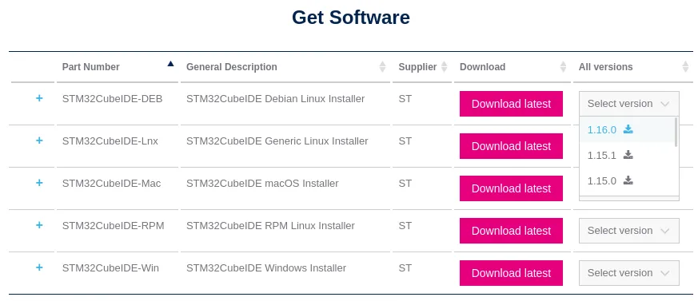
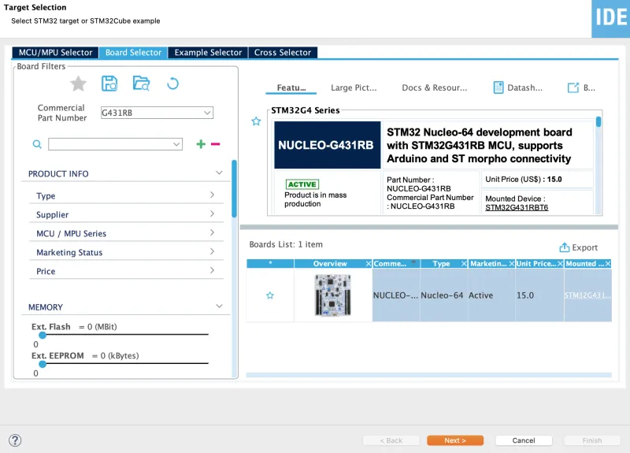
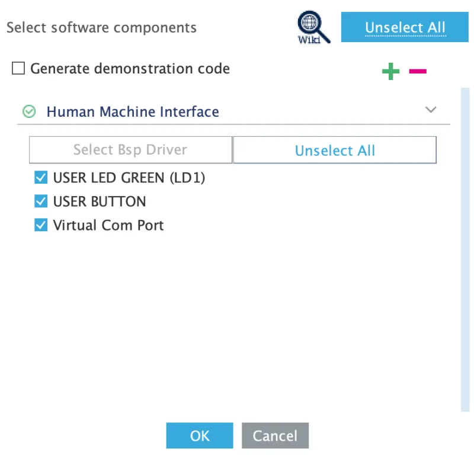

# STM32CubeIDE

## About
STM32CubeIDE allows the user to write, compile, and flash code to the STM32 microcontroller! The IDE
is based on the Eclipse framework and contains the GCC compiler and GDB debugging tool for in
program compilation and debugging. The IDE also has flashing functionality for easy and quick
programming of the STM32 microcontroller. The IDE provides a very powerful interface for automatic
code generation, allowing the user to initialize an entire module with a few clicks of a button, and
have that code show up automatically in the main file.

## Downloading and Installing
### Download
1. Go to the CubeIDE [download page](https://www.st.com/en/development-tools/stm32cubeide.html) and scroll down to "Get Software."
   

2. Click on "Select Version &rarr; 1.16.0" for the correct OS you are running. For this walkthrough,
we will be using the <em>Debian</em> Linux installer.

3. Click on Accept for the License Agreement pop up.

4. You will then be prompted to log in, create an account, or continue as a guest. You will need a
MyST account in the future, so it is best to create one now. You may use any email address.

5. After logging in and being brought back to the download page, scroll back down to "Get Software".
It may take a while for the "Get Software" section to load.

6. Download version 1.16.0 of the OS you are running. Again, this tutorial will be using the <em>Debian</em>
Linux installer.

### Install
1\. Open a new terminal ([guide](https://www.howtogeek.com/686955/how-to-launch-a-terminal-window-on-ubuntu-linux/)).

2\. The downloaded installer zip file should be in your `Downloads` folder. You can navigate to this
folder by entering the following command in your terminal:
```sh
cd ~/Downloads
```

3\. You should now be able to see the installer `.zip` file, if you run the following command:

```sh
ls
```

4\. To unzip the installer, run the following command (this may take a second):

```sh
unzip <zip_file_name>
```

For example:
```sh
unzip en.st-stm32cubeide_1.16.0_21983_20240628_1741_amd64.deb_bundle.sh.zip
```

5\. You should now be able to see the installer `.zip` file along with the installer `.sh` file if
you repeat the `ls` command in step 3.

6\. Run the installer by running the following (you may be prompted to enter your password):

```sh
sudo sh <sh_file_name>
```

For example:
```sh
sudo sh st-stm32cubeide_1.16.0_21983_20240628_1741_amd64.deb_bundle.sh
```

7\. Accept the installer license agreement by entering `s` until you are given the option to accept.
Then, enter `y` and then the `Enter` key.

8\. Install the Segger J-Link udev rules by clicking `y` and then the `Enter` key.

9\. Accept the Segger J-Link license agreement by entering `s` until you are given the option to accept.
Then, click `y` and then the `Enter` key.

10\. It may take a while to install. You are done once you have seen the following:
```
STM32CubeIDE installed successfully
```

11\. You should now be able to launch STM32CubeIDE from the Ubuntu Applications menu ([guide](https://help.ubuntu.com/stable/ubuntu-help/shell-apps-open.html.en)).

## Creating a New Project
This quick guide will teach you how to make a new project for your STM32G431RB Nucleo board that you
will be developing on.

### Prerequisites
* STM32CubeIDE [installed](#installing)

### Guide
Open STM32CubeIDE, select the desired workspace, and click `Launch` (the default is fine for now).


In the top left, go to `File`&#8594;`New`&#8594;`STM32 Project`.


You may experience some lag after the previous step. Eventually, you will be prompted with the following window:


At the top, select the `Board Selector` option.
Then on the left, in the text box next to `Commercial Part Number`, type `G431RB`.
There should only be one option in the `Boards List` Section, click that and press `Next`:



Now you will be prompted with the following window:


Here you can name your project whatever you want, but we can just call it "tutorial".  Leave everything else as default and click Finish.

You will then be prompted with this window to configure this board. Make sure to uncheck all the
boxes by clicking `Unselect All`. Then select `OK`.



It may also ask about changing perspective. Here, it comes down to preference, but you can just click `Yes`.


You should now see the following screen, which means that you have successfully created the project!
Notice the graphical interface of the chip on the right (which we may call the `.ioc` file) and the
files on the left that fall under the tutorial project (most importantly, `Src/main.c` and
`tutorial.ioc`). Cool things to know is the graphical interface is used to make changes to the chip
settings. If changes are made, then once the project is saved, code will be auto-generated for the
user. The `main.c` file is where you will want to write your code.


**Congratulations! You have successfully created a new project in CubeIDE!**

## Opening an Existing Project
This quick guide will teach you how to open an existing STM32 project in your STM32CubeIDE workspace.

### Prerequisites
* STM32CubeIDE [installed](#installing)
* Any existing STM32 project downloaded

### Guide

Open up STM32CubeIDE.

Then, select the desired workspace that you want to open the project in and click `Launch`.

In the top left, go to `File`&#8594;`Open Projects from File System`.

Open the project directory in `Import source`.

Click `Finish`.

**Congratulations! You have successfully opened an existing project in CubeIDE!**

***Note:*** Your project files will remain in the original directory that you opened
and any changes you make in STM32CubeIDE will reflect in the original directory.
All that you have done is added the project to the workspace, allowing you to
open it in STM32CubeIDE.
