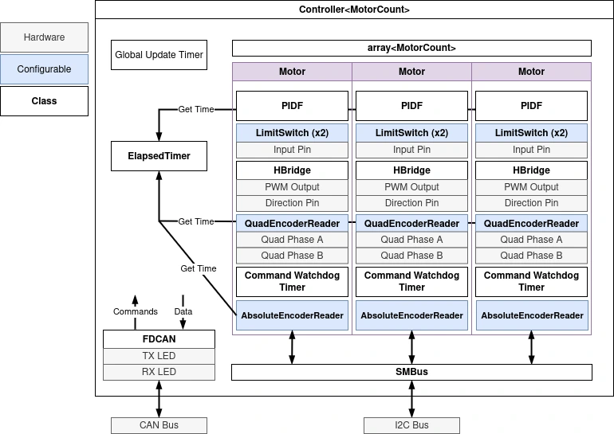

# Brushed DC Motors

Our brushed motors are controlled with a custom PCB that we call the "3BM". This
motor controller can control up to three brushed motors. It can support up to two limit
switches per motor and a total of one absolute encoder and one quadrature encoder.
We communicate with the board using CAN. The board communicates with the absolute encoder
using I2C.

## Code Structure

The driver code is in `controller.cpp` and the main motor control logic is in `motor.hpp`.
Motor CAN IDs and the number of motors is configured in `common.hpp`.
`controller.cpp` constructs up to three motors, initalizes the CAN bus, and starts the global
timers.

## Architecture

Below is a diagram of the 3BM architecture.

## Timer Overview

The 3BM uses seven hardware timers:

- **htim1** (`PWM_TIMER_[0,1,2]`): PWM timer for the three motors (`TIM_CHANNEL_[0,1,2]` for motor [0,1,2], respectively)
- **htim2** (`GENERIC_ELAPSED_TIMER`): Repeating count up timer where each tick is 0.001 ms (1000 ns). It used used by:
    - The absolute and quadrature encoder to measure how much time has elapsed since the last reading in order to measure velocity
    - The PIDF controller in order to measure the time elapsed since the last reading to update the "D" term
- **htim4** (`QUADRATURE_TICK_TIMER`): Incremental encoder timer configured to read a two-phase quadrature encoder
- **htim6** (`GLOBAL_UPDATE_TIMER`): 20 Hz timer which triggers a CAN FD transmit (sends motor state)
- **htim15**, **htim16**, **htim17** (`RECEIVE_WATCHDOG_TIMER_[0,1,2]`): FDCAN watchdog timer that needs to be reset every time a message is received
