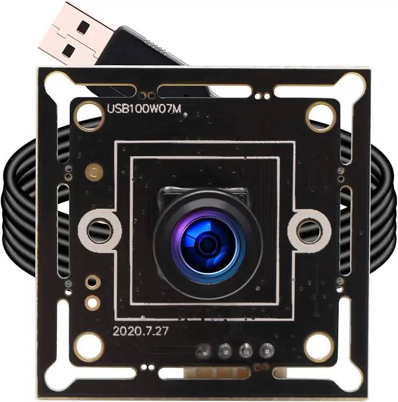
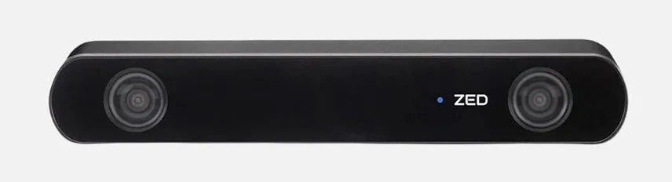
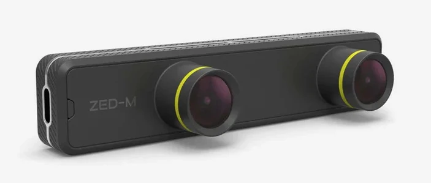

# Cameras

Our rover is capable of supporting up to 15 concurrent camera streams. To achieve this we utilize multiple different cameras along with a Startech 4-Port PCIE card with 4 independent USB 3.2 controllers. We use the following cameras on the rover:

## USB 2.0 Cameras
For the 2025-2026 competition year our team used mostly USB 2.0 cameras. These cameras provided us with a cheap and simple option for capturing multiple camera streams. Up to three USB 2.0 cameras can be placed on a single USB sontroller. For the most part, the Startech PCIE card ports are populated by these USB 2.0 cameras.

## StereoLabs ZED Camera
Our team uses a single ZED stereo camera. The ZED is used for object detection and point cloud creation during the autonomous mission. The ZED populates one of the USB-C ports of the Jetson.

## StereoLabs ZED Mini Camera
Our team also uses a single ZED Mini stereo camera. The ZED Mini is mounted to our team's mast gimbal and serves as a rotatable camera for missions, as well as taking a panorama during the science mission. The ZED Mini populates one of the USB-C ports of the Jetson.

## Adding a camera
To add a camera first check the existing UDEV rules and make sure that a device is defined for the port that you want to add the camera to. For instance, if you want to add a USB camera to the first slot of the splitter on port A, ensure that port_a1_cam exists in the UDEV rules. You can check if the UDEV rule is working as expected by looking for the device in /dev when the camera is connected to the desired port.

Next, add a new camera to config/cameras.yaml. Ensure that the new camera uses the correct device name and a unique port. For USB 2.0 cameras set the dimensons to 640x480 and the framerate to 15fps to ensure that three cameras can fit within bandwidth limits. If the camera that you are adding is the ZED or ZED Mini instead provide the desired image topic. After updating the camera config update the corresponding client config. For instance if you added a camera to the arm update config/arm_client.yaml.

Finally, launch correct camera client launch file for desired camera setup. For instance if you want to use the arm setup launch jetson_arm.launch.py.