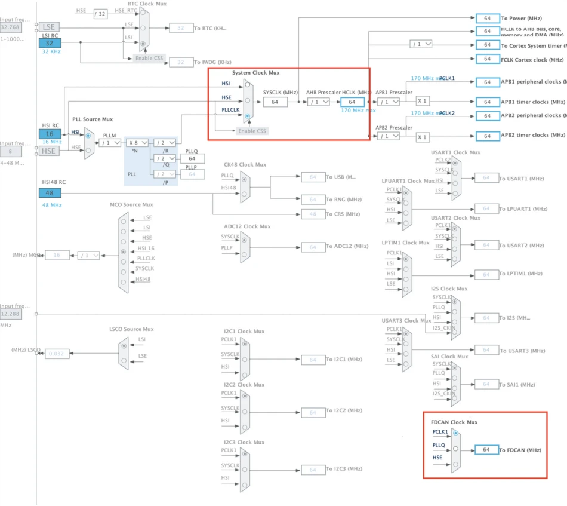
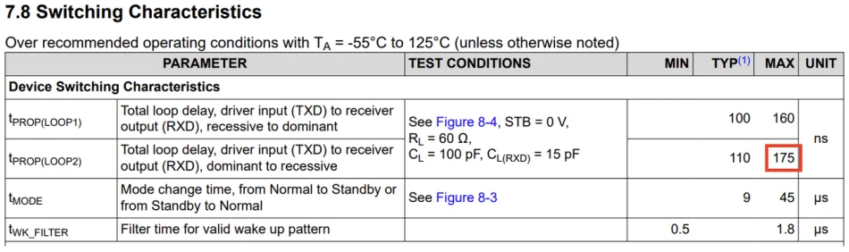

# Communication Protocols

## SPI

## UART

## I2C

## CAN

Controller Area Network (CAN) is a communication protocol that is used in many embedded systems,
especially in industrial and automotive contexts where reliability is important. Devices speak to
each other on a CAN bus, which is composed of two wires: CAN High (CANH) and CAN Low (CANL).
CAN is a serial, multimaster, multicast protocol, which means that when the bus is free, any node
can send a message (multimaster), and all nodes may receive and act on the message (multicast).

The CAN protocol has evolved over time. It has three versions, introduced in chronological order:

1. CAN 2.0A
2. CAN 2.0B
3. CAN FD

Each version adds more features to the protocol while maintaining backwards compatibility.

There are four types of CAN messages, or “frames:” the Data Frame, Remote Frame, Error Frame and
Overload Frame. The data frame is the standard CAN message, broadcasting data from the transmitter
to the other nodes on the bus. A remote frame is broadcast by a transmitter to request data from a
specific node. An error frame may be transmitted by any node that detects a bus error. Overload
frames are used to introduce additional delay between data or remote frames.

The data frame is the most common frame type and is what this guide will cover. The data frame
is made up of two important parts: the identifier and the data. The identifier can be used to
determine the priority of the message. The lower the identifier, the higher the priority of the
message. Furthermore, the identifier can be used to determine the source of the message, the
destination of the message, or the type of message being sent. The data is the actual information
being sent by the transmitter to the other nodes on the bus. The length of the identifier and data
can vary depending on the version of CAN being used.

There are many other fields in the data frame, but for the purposes of this guide, we will only cover
the identifier and data. Refer to [this document](https://www.eecs.umich.edu/courses/eecs461/doc/CAN_notes.pdf)
for a more in-depth look at the CAN protocol.

### CAN 2.0

CAN 2.0A is the original version of the CAN protocol. It supports an identifier up to 11 bits and
data packets up to 8 bytes in length.

CAN 2.0B is an extension of CAN 2.0A. It supports an identifier of either 11 bits or 29 bits and
data packets up to 8 bytes in length. The 29-bit identifier allows for more unique identifiers
to be used on the bus.

All CAN 2.0 messages can be sent at a maximum rate of 1 Mbps.

### CAN FD

CAN FD is the latest version of the CAN protocol. It supports an identifier of either 11 bits or
29 bits and data packets up to 64 bytes in length. The FD stands for Flexible Data-rate, which
means that the data can be sent at a different rate than the rest of the message. This allows for
a maximum data rate of 8 Mbps (although 5 Mbps is a more practical limit). The other parts of the
message are sent at a maximum rate of 1 Mbps. The rate in which data is sent is often called the
"data rate," while the rate in which the rest of the message is sent is called the "nominal rate."

As a side note, although CAN FD can send up to 64 bytes of data in a single message, this does
not mean that the data payload of the message can be any value up to 64 bytes. The data payload
can be the following lengths: 0 to 8, 12, 16, 20, 24, 32, 48, or 64.

### CAN Bit Timing

When using CAN, you will need to configure the bit timing. The bit timing determines how fast we
send and receive messages on the CAN bus. The bit timing parameters are:

1. Prescaler
2. Sync Jump Width
3. Time Seg 1
4. Time Seg 2

For CAN FD, data can be sent at a different rate than the rest of the message. So we end up
with two different sets of bit timing parameters:

1. Nominal Prescaler
2. Nominal Sync Jump Width
3. Nominal Time Seg 1
4. Nominal Time Seg 2
5. Data Prescaler
6. Data Sync Jump Width
7. Data Time Seg 1
8. Data Time Seg 2

For an in-depth guide on what these values mean, [this video](https://www.youtube.com/watch?v=se204xfyb4g),
although long, is very informative.

#### Using the Kvaser Bit Timing Calculator

We will go over finding these values for ***STM32 MCUs*** using an [online tool](https://www.kvaser.com/support/calculators/can-fd-bit-timing-calculator/)
provided by Kvaser. However, the process is similar for other microcontrollers and CAN hardware.

The tool requires three values that are properties of the hardware you are using:

1. Clock Frequency
2. Clock Tolerance
3. Node Delay

The clock frequency of the FDCAN peripheral is based on the system clock. It can
be found and modified by the user in the `Clock Configuration` tab of the .ioc in STM32CubeIDE.
The example below shows a clock configuration where the FDCAN peripheral clock frequency is 64 MHz.

The clock tolerance (measured in ppm) is a physical characteristic of the clock of the CAN FD hardware.
Based on the specific clock configuration shown above, we can see that the FDCAN peripheral is using
PCLK1 (FDCAN Clock Mux). PCLK1 is based on PLLCLK (System Clock Mux). Finally, PLLCLK is based on
HSI16 (PLL Source Mux). We can find the characteristics in the datasheet. The table with the
characteristics of the HSI16 oscillator for the STM32G431 is shown below.

We then perform the following calculation:

(16.08 - 16) / 16 = 0.005

For these values, we can use an [online tool](https://www.kvaser.com/support/calculators/can-fd-bit-timing-calculator/)
provided by Kvaser.

The tool requires three values that are properties of the hardware you are using:

1. Clock Frequency
2. Clock Tolerance
3. Node Delay

We will go over finding these values for ***STM32 MCUs***.

The clock frequency of the FDCAN peripheral is based on the system clock. It can
be found and modified by the user in the `Clock Configuration` tab of the .ioc in STM32CubeIDE.
The example below shows a clock configuration where the FDCAN peripheral clock frequency is 64 MHz.

The clock tolerance (measured in ppm) is a physical characteristic of the clock of the CAN FD hardware.
Based on the specific clock configuration shown above, we can see that the FDCAN peripheral is using
PCLK1 (FDCAN Clock Mux). PCLK1 is based on PLLCLK (System Clock Mux). Finally, PLLCLK is based on
HSI16 (PLL Source Mux). We can find the characteristics in the datasheet. The table with the
characteristics of the HSI16 oscillator for the STM32G431 is shown below.

We then perform the following calculation:

(16.08 - 16) / 16 = 0.005

0.005 * 1,000,000 = **5,000 ppm**

The node delay is the max input/output propagation delay of our CAN transceiver. This value is
dependent on the CAN transceiver that we are using. For the TCAN1042, the max propagation delay is
**175 ns** as shown below. Refer to the datasheet of the transceiver you are using to find this
value.

With these values, we can now use the [Kvaser tool](https://www.kvaser.com/support/calculators/can-fd-bit-timing-calculator/)
to calculate the bit timing values for our CAN bus.

Scroll down to **1. Device Characteristics** and make sure to delete the default device that has been added.
Then, input the clock frequency, clock tolerance, and node delay. Click `Add CAN Device`.

Then, scroll down to **2. Bitrates** and input the desired bitrate for the CAN bus. Click `Recalculate`.

Now in sections **3.1** and **3.2**, you can make changes to the nominal and data sample point
percentages. Any percentage from 50% to 90% is acceptable. Many automotive applications use a value
around 87.5% for nominal and around 70% - 80% for data.

Finally, scroll down to **4. Individual Bus Timing Parameters** and you will see the values for the
bit timing parameters. You may also modify the prescaler (the data prescaler must be equal to 1 or
2).

